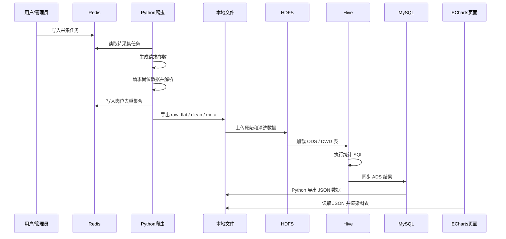
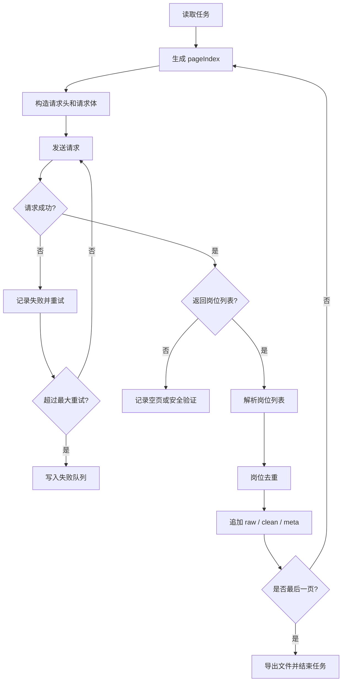
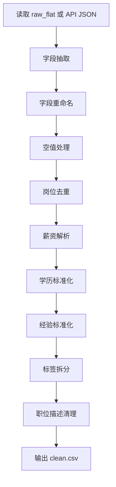

# 智联招聘爬虫数据分析系统详细设计文档

## 1. 文档说明

### 1.1 文档目的

本文档在《智联招聘爬虫数据分析系统需求文档》的基础上，对系统的模块划分、数据流程、爬虫采集、数据清洗、HDFS 存储、Hive 数仓、MySQL 结果库、Redis 缓存、ECharts 可视化和运行部署进行详细设计。

本文档用于指导后续编码、调试、测试、部署和答辩说明。

### 1.2 设计范围

本系统采用离线数据分析架构，不单独开发 Java 后端。系统主要由以下部分组成：

1. Python 爬虫采集模块。
2. Redis 任务队列与去重模块。
3. Python 数据清洗与文件导出模块。
4. HDFS 数据存储模块。
5. Hive 数据仓库与统计分析模块。
6. MySQL 任务日志和分析结果库。
7. Python 结果导出模块。
8. ECharts 前端可视化页面。

### 1.3 技术选型

| 技术 | 版本 | 详细设计用途 |
| --- | --- | --- |
| Python | 3.x | 爬虫、清洗、ETL、MySQL 结果导出 |
| Redis | 5.0.14.1 | 任务队列、岗位去重、失败重试、缓存 |
| Hadoop | 3.3.6 | HDFS 存储原始数据、清洗数据和中间数据 |
| Hive | 4.0.1 | 建立 ODS、DWD、DWS、ADS 数据表 |
| MySQL | 8.4.4 | 保存任务配置、执行日志和分析结果 |
| ECharts | 按实际引入版本 | 前端图表展示 |
| ChromeDriver | 本地版本 | 必要时辅助页面验证 |
| JDK | 本地安装版本 | Hadoop/Hive 运行依赖，不作为业务开发技术 |

## 2. 系统总体设计

### 2.1 总体架构

系统采用“采集、缓存、存储、数仓、结果、展示”的离线分析架构。


### 2.2 系统执行流程



### 2.3 设计原则

1. 原始数据必须保留，避免接口字段变化后无法追溯。
2. 清洗逻辑和分析逻辑分离，保证数据处理过程可重跑。
3. Redis 只保存任务状态、去重标记和缓存，不作为长期数据仓库。
4. Hive 负责大批量统计分析，MySQL 只保存轻量分析结果。
5. ECharts 页面只负责展示，不直接处理复杂清洗逻辑。
6. 不绕过登录、验证码、付费和权限控制，只采集公开展示数据。

## 3. 项目目录设计

建议项目目录如下：

```text
zhaopin-analysis/
  crawler/
    config.py
    run_crawler.py
    request_builder.py
    fetcher.py
    parser.py
    cleaner.py
    exporter.py
    redis_queue.py
    logger.py
  data/
    raw/
    clean/
    meta/
    dashboard/
  hadoop/
    upload_to_hdfs.ps1
    hdfs_dirs.md
  hive/
    ods/
      ods_zhaopin_job_raw.sql
    dwd/
      dwd_zhaopin_job_clean.sql
    dws/
      dws_analysis.sql
    ads/
      ads_dashboard.sql
  mysql/
    mysql_schema.sql
    hive_to_mysql.py
    query_mysql.py
  visualization/
    index.html
    css/
      style.css
    js/
      echarts.min.js
      dashboard.js
    data/
      dashboard_summary.json
      city_salary.json
      education.json
      experience.json
      company.json
      skill_words.json
  logs/
    crawler.log
    etl.log
  docs/
    智联招聘爬虫数据分析需求文档.md
    智联招聘爬虫数据分析系统详细设计文档.md
```

## 4. Python 爬虫模块设计

### 4.1 模块划分

| 模块 | 文件 | 职责 |
| --- | --- | --- |
| 配置模块 | config.py | 管理关键词、城市编码、页码、请求间隔、输出目录 |
| 任务队列模块 | redis_queue.py | 从 Redis 读取任务、写入失败任务、维护任务状态 |
| 请求构造模块 | request_builder.py | 构造搜索 URL、API URL、请求头和请求体 |
| 请求模块 | fetcher.py | 发送 HTTP 请求、处理超时、重试和异常 |
| 解析模块 | parser.py | 解析 API JSON，提取岗位列表和分页信息 |
| 清洗模块 | cleaner.py | 字段标准化、薪资解析、学历经验归一化 |
| 导出模块 | exporter.py | 导出 clean.csv、raw_flat.csv、meta.csv、xlsx |
| 主程序 | run_crawler.py | 串联任务读取、采集、清洗、导出、日志记录 |
| 日志模块 | logger.py | 统一输出运行日志和错误日志 |

### 4.2 配置设计

`config.py` 中建议维护以下配置：

```python
DEFAULT_KEYWORDS = ["大数据", "Python", "数据分析"]
DEFAULT_CITY_CODES = {
    "重庆": "551",
    "成都": "801",
    "北京": "530",
    "上海": "538",
    "深圳": "765",
    "杭州": "653"
}

PAGE_START = 1
PAGE_END = 5
PAGE_SIZE = 20
REQUEST_INTERVAL_SECONDS = 1.5
MAX_RETRY = 3
OUTPUT_DIR = "data"
```

### 4.3 采集任务结构

每个采集任务使用 JSON 格式表示：

```json
{
  "task_id": "20260615_zhcq_bigdata_001",
  "keyword": "大数据",
  "city": "重庆",
  "city_code": "551",
  "page_start": 1,
  "page_end": 5,
  "page_size": 20,
  "order": 4,
  "max_retry": 3
}
```

字段说明：

| 字段 | 说明 |
| --- | --- |
| task_id | 任务唯一编号 |
| keyword | 搜索关键词 |
| city | 城市名称 |
| city_code | 智联招聘城市编码 |
| page_start | 开始页码 |
| page_end | 结束页码 |
| page_size | 每页条数 |
| order | 搜索排序参数 |
| max_retry | 最大重试次数 |

### 4.4 请求设计

系统优先使用公开岗位搜索结果对应的 JSON 数据接口。原 HTML 页面路径只作为来源 URL 和人工排查参考，不作为默认解析来源。

请求设计如下：

| 项目 | 设计 |
| --- | --- |
| 请求方式 | POST |
| 数据来源 | 智联招聘岗位搜索结果对应 JSON 数据 |
| 返回格式 | JSON |
| 分页字段 | pageIndex、pageSize |
| 城市字段 | S_SOU_WORK_CITY |
| 关键词字段 | S_SOU_FULL_INDEX |
| 验证字段 | data.list、data.count、data.isEndPage |

请求体示例：

```json
{
  "S_SOU_FULL_INDEX": "大数据",
  "pageIndex": 1,
  "pageSize": 20,
  "anonymous": 1,
  "eventScenario": "pcSearchedSouSearch",
  "platform": 13,
  "version": "0.0.0",
  "order": 4,
  "S_SOU_WORK_CITY": "551"
}
```

### 4.5 采集流程设计



### 4.6 去重设计

岗位去重分为两层：

| 层级 | 去重方式 | 说明 |
| --- | --- | --- |
| 采集期去重 | Redis Set | 使用岗位 ID 或职位编号避免重复处理 |
| 清洗期去重 | DataFrame 去重 | 使用岗位 ID、公司名称、岗位名称、城市组合去重 |

Redis 去重 Key：

```text
zhaopin:job:visited:{crawl_date}
```

去重值优先级：

```text
职位ID > 职位编号 > 公司名称 + 职位名称 + 工作城市
```

### 4.7 异常处理设计

| 异常类型 | 判断方式 | 处理方式 |
| --- | --- | --- |
| 请求超时 | requests timeout | 重试，超过次数写入失败队列 |
| 返回空列表 | data.list 为空 | 记录 meta，不直接中断整个任务 |
| 安全验证 | title 或响应文本包含 Security Verification | 暂停任务，记录异常 |
| 接口字段变化 | data、list、count 字段缺失 | 保存原始响应，标记解析失败 |
| 文件写入失败 | IO 异常 | 记录日志并终止当前任务 |
| Redis 不可用 | 连接异常 | 降级为本地任务列表执行 |

## 5. 数据文件设计

### 5.1 文件类型

采集完成后，每个任务输出三类核心文件：

| 文件 | 示例 | 用途 |
| --- | --- | --- |
| 清洗数据 | zhaopin_重庆_大数据_20260611_clean.csv | 后续分析和 Hive DWD 加载 |
| 原始展平数据 | zhaopin_重庆_大数据_20260611_raw_flat.csv | 字段追溯和二次开发 |
| 采集元数据 | zhaopin_重庆_大数据_20260611_meta.csv | 记录每页采集状态 |

可选输出 Excel 文件，将三类数据写入不同 Sheet，便于人工查看。

### 5.2 clean.csv 字段设计

| 中文字段 | 目标英文字段 | 说明 |
| --- | --- | --- |
| 搜索关键词 | keyword | 采集任务关键词 |
| 搜索城市 | search_city | 用户指定城市 |
| 城市代码 | city_code | 智联招聘城市编码 |
| 页码 | page_index | 数据来源页码 |
| 职位ID | job_id | 岗位唯一 ID |
| 职位编号 | job_code | 岗位编号 |
| 职位名称 | job_name | 岗位名称 |
| 职位URL | job_url | 岗位详情 URL |
| 薪资 | salary | 展示薪资 |
| 薪资原始区间 | salary_raw_range | 原始薪资区间 |
| 工作城市 | city | 岗位所在城市 |
| 行政区 | district | 行政区 |
| 经验要求 | experience | 工作经验要求 |
| 学历要求 | education | 学历要求 |
| 工作类型 | job_type | 全职、兼职等 |
| 工作模式 | work_mode | 现场、远程等 |
| 职位类别 | job_category | 岗位分类 |
| 公司名称 | company_name | 招聘公司名称 |
| 公司规模 | company_size | 公司人数规模 |
| 公司性质 | company_type | 民营、国企等 |
| 融资阶段 | finance_stage | 公司融资情况 |
| 行业 | industry | 所属行业 |
| 发布时间 | publish_time | 岗位发布时间 |
| 招聘人数 | recruit_count | 招聘人数 |
| HR姓名 | hr_name | 招聘联系人 |
| HR状态 | hr_status | HR 活跃状态 |
| 技能标签 | skill_tags | 技能关键词 |
| 福利标签 | welfare_tags | 福利关键词 |
| 职位描述 | job_desc | 岗位描述 |
| 原始JSON | raw_json | 原始岗位 JSON |

### 5.3 meta.csv 字段设计

| 字段 | 说明 |
| --- | --- |
| page | 页码 |
| url | 可读搜索 URL |
| api_url | 实际请求 API URL |
| jobs | 当前页返回岗位数量 |
| site_pages | 网站返回总页数 |
| position_count | 网站返回岗位总数 |
| is_end_page | 是否最后一页 |
| is_verification | 是否疑似安全验证 |
| task_id | 当前采集任务 ID |
| request_payload | 当前页请求参数 |

### 5.4 文件命名规则

文件命名格式：

```text
zhaopin_{城市}_{关键词}_{采集时间}_{文件类型}.{扩展名}
```

示例：

```text
zhaopin_重庆_大数据_20260611_151252_clean.csv
zhaopin_重庆_大数据_20260611_151252_raw_flat.csv
zhaopin_重庆_大数据_20260611_151252_meta.csv
zhaopin_重庆_大数据_20260611_151252.xlsx
```

## 6. 数据清洗详细设计

### 6.1 清洗流程



### 6.2 薪资解析规则

薪资字段解析为 `salary_min`、`salary_max`、`salary_avg` 三个数值字段。

| 原始格式 | 解析规则 | 示例结果 |
| --- | --- | --- |
| 8千-1.2万 | 千按 1000，万按 10000 | 8000、12000、10000 |
| 15-20K | K 按 1000 | 15000、20000、17500 |
| 9000-18000元 | 直接取数值 | 9000、18000、13500 |
| 面议 | 数值字段置空 | NULL、NULL、NULL |
| 1万以上 | 最低薪资为 10000，最高薪资置空 | 10000、NULL、10000 |

处理步骤：

1. 去除空格、中文逗号、人民币符号。
2. 识别“千、万、K、元”等单位。
3. 识别区间薪资和单值薪资。
4. 计算平均薪资。
5. 无法解析时保留原始薪资文本。

### 6.3 学历标准化规则

| 原始值 | 标准值 |
| --- | --- |
| 不限、学历不限 | 不限 |
| 中专、中技、高中 | 中专/高中 |
| 大专 | 大专 |
| 本科 | 本科 |
| 硕士、研究生 | 硕士 |
| 博士 | 博士 |
| 空值 | 未知 |

### 6.4 经验标准化规则

| 原始值 | 标准值 |
| --- | --- |
| 经验不限、不限 | 不限 |
| 应届毕业生、在校生 | 应届 |
| 1年以内 | 1年以内 |
| 1-3年 | 1-3年 |
| 3-5年 | 3-5年 |
| 5-10年 | 5-10年 |
| 10年以上 | 10年以上 |
| 空值 | 未知 |

### 6.5 标签处理规则

技能标签和福利标签通常使用 `|`、`,`、`，`、空格等分隔符。清洗时应统一拆分成列表，再用于词频统计。

处理规则：

1. 将中文逗号、英文逗号、竖线统一为同一种分隔符。
2. 去除空字符串和重复标签。
3. 保留原始标签字符串。
4. 生成词频统计时按单个标签展开。

### 6.6 质量校验规则

| 校验项 | 规则 |
| --- | --- |
| 岗位 ID | 不能为空；为空时使用岗位 URL 或组合键代替 |
| 岗位名称 | 不能为空 |
| 公司名称 | 为空时填充“未知公司” |
| 城市 | 为空时使用搜索城市补齐 |
| 薪资 | 原始值保留，解析失败不删除记录 |
| 学历 | 不在标准范围内时归为“其他” |
| 经验 | 不在标准范围内时归为“其他” |
| 原始 JSON | 必须保留，便于追溯 |

## 7. Redis 详细设计

### 7.1 Redis Key 规划

| Key | 类型 | 说明 |
| --- | --- | --- |
| zhaopin:task:queue | List | 待执行任务队列 |
| zhaopin:task:failed | List | 失败任务队列 |
| zhaopin:task:running | Set | 正在执行的任务 |
| zhaopin:task:done | Set | 已完成任务 |
| zhaopin:task:status:{task_id} | Hash | 单个任务状态 |
| zhaopin:job:visited:{crawl_date} | Set | 当日已采集岗位去重集合 |
| zhaopin:rate:limit:{city_code} | String | 城市级请求限速标记 |
| zhaopin:cache:dashboard | String | 看板汇总缓存 |

### 7.2 任务状态设计

任务状态值：

| 状态 | 说明 |
| --- | --- |
| WAITING | 等待执行 |
| RUNNING | 正在执行 |
| SUCCESS | 执行成功 |
| FAILED | 执行失败 |
| PAUSED | 因安全验证或连续失败暂停 |

任务状态 Hash 示例：

```text
zhaopin:task:status:20260615_zhcq_bigdata_001
  keyword: 大数据
  city: 重庆
  page_start: 1
  page_end: 5
  current_page: 3
  success_count: 40
  failed_count: 0
  status: RUNNING
  start_time: 2026-06-15 10:00:00
  update_time: 2026-06-15 10:02:00
```

### 7.3 失败重试设计

1. 请求失败后最多重试 3 次。
2. 每次重试前等待时间递增，例如 2 秒、5 秒、10 秒。
3. 超过最大重试次数后写入 `zhaopin:task:failed`。
4. 失败记录必须包含任务参数、失败页码、错误信息和失败时间。
5. 失败任务可由人工检查后重新放回 `zhaopin:task:queue`。

## 8. HDFS 存储设计

### 8.1 目录规划

```text
/zhaopin/
  raw/
    crawl_date=2026-06-15/
      city=重庆/
        keyword=大数据/
  clean/
    crawl_date=2026-06-15/
      city=重庆/
        keyword=大数据/
  meta/
    crawl_date=2026-06-15/
  hive/
  result/
    crawl_date=2026-06-15/
  logs/
```

### 8.2 上传规则

| 本地文件 | HDFS 目录 | 说明 |
| --- | --- | --- |
| raw_flat.csv | /zhaopin/raw/ | 原始展平数据 |
| clean.csv | /zhaopin/clean/ | 清洗后的明细数据 |
| meta.csv | /zhaopin/meta/ | 采集日志和请求参数 |
| ads_*.csv | /zhaopin/result/ | Hive 分析结果导出 |

### 8.3 上传命令设计

Windows 环境建议使用 PowerShell 脚本封装 HDFS 上传命令：

```powershell
hdfs dfs -mkdir -p /zhaopin/raw/crawl_date=2026-06-15/city=重庆/keyword=大数据
hdfs dfs -put -f data/raw/zhaopin_重庆_大数据_20260615_raw_flat.csv /zhaopin/raw/crawl_date=2026-06-15/city=重庆/keyword=大数据/

hdfs dfs -mkdir -p /zhaopin/clean/crawl_date=2026-06-15/city=重庆/keyword=大数据
hdfs dfs -put -f data/clean/zhaopin_重庆_大数据_20260615_clean.csv /zhaopin/clean/crawl_date=2026-06-15/city=重庆/keyword=大数据/
```

## 9. Hive 数据仓库详细设计

### 9.1 数仓分层

| 层级 | 表名 | 说明 |
| --- | --- | --- |
| ODS | ods_zhaopin_job_raw | 原始数据层，保留原始 JSON 和采集参数 |
| DWD | dwd_zhaopin_job_clean | 清洗明细层，一行表示一个岗位 |
| DWS | dws_zhaopin_city_salary | 城市薪资汇总 |
| DWS | dws_zhaopin_education | 学历要求汇总 |
| DWS | dws_zhaopin_experience | 经验要求汇总 |
| DWS | dws_zhaopin_company | 公司类型和规模汇总 |
| DWS | dws_zhaopin_skill_word | 技能词频汇总 |
| ADS | ads_zhaopin_dashboard | ECharts 看板结果层 |

### 9.2 ODS 表设计

```sql
CREATE TABLE IF NOT EXISTS ods_zhaopin_job_raw (
    raw_json STRING COMMENT '原始JSON',
    source_url STRING COMMENT '来源URL',
    api_url STRING COMMENT 'API请求URL',
    keyword STRING COMMENT '搜索关键词',
    search_city STRING COMMENT '搜索城市',
    city_code STRING COMMENT '城市编码',
    page_index INT COMMENT '页码',
    task_id STRING COMMENT '任务ID',
    request_payload STRING COMMENT '请求参数',
    crawl_time STRING COMMENT '采集时间'
)
PARTITIONED BY (crawl_date STRING)
ROW FORMAT DELIMITED
FIELDS TERMINATED BY '\t'
STORED AS TEXTFILE;
```

### 9.3 DWD 表设计

```sql
CREATE TABLE IF NOT EXISTS dwd_zhaopin_job_clean (
    job_id STRING COMMENT '职位ID',
    job_code STRING COMMENT '职位编号',
    job_name STRING COMMENT '职位名称',
    job_url STRING COMMENT '职位URL',
    keyword STRING COMMENT '搜索关键词',
    search_city STRING COMMENT '搜索城市',
    city_code STRING COMMENT '城市代码',
    city STRING COMMENT '工作城市',
    district STRING COMMENT '行政区',
    salary STRING COMMENT '原始薪资',
    salary_min DOUBLE COMMENT '最低薪资',
    salary_max DOUBLE COMMENT '最高薪资',
    salary_avg DOUBLE COMMENT '平均薪资',
    experience STRING COMMENT '经验要求',
    education STRING COMMENT '学历要求',
    job_type STRING COMMENT '工作类型',
    work_mode STRING COMMENT '工作模式',
    job_category STRING COMMENT '职位类别',
    company_name STRING COMMENT '公司名称',
    company_size STRING COMMENT '公司规模',
    company_type STRING COMMENT '公司性质',
    finance_stage STRING COMMENT '融资阶段',
    industry STRING COMMENT '行业',
    publish_time STRING COMMENT '发布时间',
    recruit_count INT COMMENT '招聘人数',
    skill_tags STRING COMMENT '技能标签',
    welfare_tags STRING COMMENT '福利标签',
    job_desc STRING COMMENT '职位描述',
    raw_json STRING COMMENT '原始JSON',
    crawl_time STRING COMMENT '采集时间'
)
PARTITIONED BY (crawl_date STRING)
ROW FORMAT DELIMITED
FIELDS TERMINATED BY '\t'
STORED AS TEXTFILE;
```

### 9.4 DWS 汇总表设计

#### 9.4.1 城市薪资汇总表

```sql
CREATE TABLE IF NOT EXISTS dws_zhaopin_city_salary (
    crawl_date STRING,
    keyword STRING,
    city STRING,
    job_count BIGINT,
    avg_salary DOUBLE,
    min_salary DOUBLE,
    max_salary DOUBLE
)
ROW FORMAT DELIMITED
FIELDS TERMINATED BY '\t'
STORED AS TEXTFILE;
```

#### 9.4.2 学历汇总表

```sql
CREATE TABLE IF NOT EXISTS dws_zhaopin_education (
    crawl_date STRING,
    keyword STRING,
    education STRING,
    job_count BIGINT,
    ratio DOUBLE
)
ROW FORMAT DELIMITED
FIELDS TERMINATED BY '\t'
STORED AS TEXTFILE;
```

#### 9.4.3 经验汇总表

```sql
CREATE TABLE IF NOT EXISTS dws_zhaopin_experience (
    crawl_date STRING,
    keyword STRING,
    experience STRING,
    job_count BIGINT,
    ratio DOUBLE
)
ROW FORMAT DELIMITED
FIELDS TERMINATED BY '\t'
STORED AS TEXTFILE;
```

#### 9.4.4 技能词频表

```sql
CREATE TABLE IF NOT EXISTS dws_zhaopin_skill_word (
    crawl_date STRING,
    keyword STRING,
    skill_word STRING,
    word_count BIGINT
)
ROW FORMAT DELIMITED
FIELDS TERMINATED BY '\t'
STORED AS TEXTFILE;
```

### 9.5 Hive 分析 SQL 设计

#### 9.5.1 城市岗位数量和薪资

```sql
INSERT OVERWRITE TABLE dws_zhaopin_city_salary
SELECT
    crawl_date,
    keyword,
    city,
    COUNT(*) AS job_count,
    ROUND(AVG(salary_avg), 2) AS avg_salary,
    MIN(salary_min) AS min_salary,
    MAX(salary_max) AS max_salary
FROM dwd_zhaopin_job_clean
WHERE city IS NOT NULL
GROUP BY crawl_date, keyword, city;
```

#### 9.5.2 学历要求统计

```sql
INSERT OVERWRITE TABLE dws_zhaopin_education
SELECT
    crawl_date,
    keyword,
    education,
    COUNT(*) AS job_count,
    ROUND(COUNT(*) / SUM(COUNT(*)) OVER(PARTITION BY crawl_date, keyword), 4) AS ratio
FROM dwd_zhaopin_job_clean
GROUP BY crawl_date, keyword, education;
```

#### 9.5.3 经验要求统计

```sql
INSERT OVERWRITE TABLE dws_zhaopin_experience
SELECT
    crawl_date,
    keyword,
    experience,
    COUNT(*) AS job_count,
    ROUND(COUNT(*) / SUM(COUNT(*)) OVER(PARTITION BY crawl_date, keyword), 4) AS ratio
FROM dwd_zhaopin_job_clean
GROUP BY crawl_date, keyword, experience;
```

#### 9.5.4 技能词频统计

```sql
INSERT OVERWRITE TABLE dws_zhaopin_skill_word
SELECT
    crawl_date,
    keyword,
    skill_word,
    COUNT(*) AS word_count
FROM dwd_zhaopin_job_clean
LATERAL VIEW explode(split(skill_tags, '\\|')) t AS skill_word
WHERE skill_word IS NOT NULL AND trim(skill_word) <> ''
GROUP BY crawl_date, keyword, skill_word;
```

## 10. MySQL 数据库详细设计

### 10.1 数据库设计说明

MySQL 用于保存轻量级业务数据和分析结果，主要供 Python 查询脚本和 ECharts 数据导出使用。

建议数据库名：

```sql
CREATE DATABASE IF NOT EXISTS zhaopin_analysis DEFAULT CHARACTER SET utf8mb4;
```

### 10.2 爬虫任务表

```sql
CREATE TABLE crawl_task (
    id BIGINT PRIMARY KEY AUTO_INCREMENT,
    task_id VARCHAR(64) NOT NULL UNIQUE,
    keyword VARCHAR(100) NOT NULL,
    city VARCHAR(50) NOT NULL,
    city_code VARCHAR(20),
    page_start INT DEFAULT 1,
    page_end INT DEFAULT 5,
    page_size INT DEFAULT 20,
    status VARCHAR(20) DEFAULT 'WAITING',
    total_count INT DEFAULT 0,
    success_count INT DEFAULT 0,
    failed_count INT DEFAULT 0,
    create_time DATETIME DEFAULT CURRENT_TIMESTAMP,
    start_time DATETIME NULL,
    end_time DATETIME NULL,
    update_time DATETIME DEFAULT CURRENT_TIMESTAMP ON UPDATE CURRENT_TIMESTAMP
);
```

### 10.3 爬虫日志表

```sql
CREATE TABLE crawl_log (
    id BIGINT PRIMARY KEY AUTO_INCREMENT,
    task_id VARCHAR(64) NOT NULL,
    keyword VARCHAR(100),
    city VARCHAR(50),
    page_index INT,
    request_url TEXT,
    api_url TEXT,
    jobs INT DEFAULT 0,
    status VARCHAR(20),
    error_message TEXT,
    request_payload TEXT,
    create_time DATETIME DEFAULT CURRENT_TIMESTAMP
);
```

### 10.4 城市薪资结果表

```sql
CREATE TABLE analysis_city_salary (
    id BIGINT PRIMARY KEY AUTO_INCREMENT,
    crawl_date DATE NOT NULL,
    keyword VARCHAR(100) NOT NULL,
    city VARCHAR(50) NOT NULL,
    job_count INT NOT NULL,
    avg_salary DECIMAL(10,2),
    min_salary DECIMAL(10,2),
    max_salary DECIMAL(10,2),
    create_time DATETIME DEFAULT CURRENT_TIMESTAMP,
    INDEX idx_city_salary_date_keyword (crawl_date, keyword)
);
```

### 10.5 学历结果表

```sql
CREATE TABLE analysis_education (
    id BIGINT PRIMARY KEY AUTO_INCREMENT,
    crawl_date DATE NOT NULL,
    keyword VARCHAR(100) NOT NULL,
    education VARCHAR(50) NOT NULL,
    job_count INT NOT NULL,
    ratio DECIMAL(10,4),
    create_time DATETIME DEFAULT CURRENT_TIMESTAMP,
    INDEX idx_education_date_keyword (crawl_date, keyword)
);
```

### 10.6 经验结果表

```sql
CREATE TABLE analysis_experience (
    id BIGINT PRIMARY KEY AUTO_INCREMENT,
    crawl_date DATE NOT NULL,
    keyword VARCHAR(100) NOT NULL,
    experience VARCHAR(50) NOT NULL,
    job_count INT NOT NULL,
    ratio DECIMAL(10,4),
    create_time DATETIME DEFAULT CURRENT_TIMESTAMP,
    INDEX idx_experience_date_keyword (crawl_date, keyword)
);
```

### 10.7 公司统计结果表

```sql
CREATE TABLE analysis_company (
    id BIGINT PRIMARY KEY AUTO_INCREMENT,
    crawl_date DATE NOT NULL,
    keyword VARCHAR(100) NOT NULL,
    dimension_type VARCHAR(50) NOT NULL,
    dimension_value VARCHAR(100) NOT NULL,
    job_count INT NOT NULL,
    create_time DATETIME DEFAULT CURRENT_TIMESTAMP,
    INDEX idx_company_date_keyword (crawl_date, keyword, dimension_type)
);
```

### 10.8 技能词频结果表

```sql
CREATE TABLE analysis_skill_word (
    id BIGINT PRIMARY KEY AUTO_INCREMENT,
    crawl_date DATE NOT NULL,
    keyword VARCHAR(100) NOT NULL,
    skill_word VARCHAR(100) NOT NULL,
    word_count INT NOT NULL,
    create_time DATETIME DEFAULT CURRENT_TIMESTAMP,
    INDEX idx_skill_date_keyword (crawl_date, keyword)
);
```

### 10.9 看板汇总表

```sql
CREATE TABLE analysis_dashboard_summary (
    id BIGINT PRIMARY KEY AUTO_INCREMENT,
    crawl_date DATE NOT NULL,
    keyword VARCHAR(100) NOT NULL,
    total_jobs INT NOT NULL,
    city_count INT NOT NULL,
    avg_salary DECIMAL(10,2),
    max_salary DECIMAL(10,2),
    min_salary DECIMAL(10,2),
    create_time DATETIME DEFAULT CURRENT_TIMESTAMP,
    UNIQUE KEY uk_dashboard_date_keyword (crawl_date, keyword)
);
```

## 11. Hive 到 MySQL 同步设计

### 11.1 同步方式

本项目建议使用 Python 脚本完成 Hive 分析结果到 MySQL 的同步。

同步流程：

1. Hive 执行 DWS/ADS 统计 SQL。
2. 将 Hive 查询结果导出为 CSV 文件。
3. Python 读取 CSV 文件。
4. Python 使用 MySQL 驱动写入 MySQL 分析结果表。
5. 写入前按 `crawl_date + keyword` 删除旧结果，保证可重复执行。

### 11.2 同步脚本设计

| 脚本 | 功能 |
| --- | --- |
| hive_to_mysql.py | 统一同步入口 |
| sync_city_salary.py | 同步城市薪资统计 |
| sync_education.py | 同步学历统计 |
| sync_experience.py | 同步经验统计 |
| sync_company.py | 同步公司统计 |
| sync_skill_word.py | 同步技能词频 |
| sync_dashboard.py | 同步看板汇总 |

### 11.3 幂等设计

每次同步前执行删除：

```sql
DELETE FROM analysis_city_salary
WHERE crawl_date = ? AND keyword = ?;
```

再执行批量插入，避免重复运行导致数据翻倍。

## 12. ECharts 可视化详细设计

### 12.1 页面结构

ECharts 页面采用静态 HTML + CSS + JavaScript 实现，通过读取 JSON 数据渲染图表。

页面区域：

| 区域 | 内容 |
| --- | --- |
| 顶部标题区 | 系统名称、采集日期、关键词 |
| 指标卡区 | 岗位总数、城市数量、平均薪资、最高薪资 |
| 城市分析区 | 城市岗位数量排行、城市平均薪资对比 |
| 要求分析区 | 学历要求占比、经验要求占比 |
| 企业分析区 | 公司规模、公司性质统计 |
| 关键词分析区 | 技能词频、福利词频 |
| 明细表格区 | Top 岗位或企业明细 |

### 12.2 前端文件设计

| 文件 | 说明 |
| --- | --- |
| index.html | 页面主体结构 |
| css/style.css | 页面样式 |
| js/echarts.min.js | ECharts 库 |
| js/dashboard.js | 图表初始化和数据绑定 |
| data/dashboard_summary.json | 指标卡数据 |
| data/city_salary.json | 城市薪资图表数据 |
| data/education.json | 学历饼图数据 |
| data/experience.json | 经验饼图数据 |
| data/company.json | 公司统计数据 |
| data/skill_words.json | 技能词频数据 |

### 12.3 JSON 数据格式设计

#### 12.3.1 看板汇总数据

```json
{
  "crawl_date": "2026-06-15",
  "keyword": "大数据",
  "total_jobs": 100,
  "city_count": 1,
  "avg_salary": 12500.00,
  "max_salary": 30000.00
}
```

#### 12.3.2 城市薪资数据

```json
[
  {
    "city": "重庆",
    "job_count": 100,
    "avg_salary": 12500.00,
    "min_salary": 6000.00,
    "max_salary": 30000.00
  }
]
```

#### 12.3.3 学历要求数据

```json
[
  { "name": "本科", "value": 45 },
  { "name": "大专", "value": 35 },
  { "name": "不限", "value": 20 }
]
```

#### 12.3.4 技能词频数据

```json
[
  { "name": "Hive", "value": 32 },
  { "name": "Spark", "value": 28 },
  { "name": "Python", "value": 20 }
]
```

### 12.4 图表设计

| 图表 | ECharts 类型 | 数据来源 |
| --- | --- | --- |
| 城市岗位排行 | bar | analysis_city_salary |
| 城市平均薪资 | bar/line | analysis_city_salary |
| 学历占比 | pie | analysis_education |
| 经验占比 | pie | analysis_experience |
| 公司规模分布 | pie/bar | analysis_company |
| 技能词频 | wordCloud/bar | analysis_skill_word |
| 岗位趋势 | line | 按 crawl_date 聚合结果 |

### 12.5 ECharts 配置示例

```javascript
const cityJobOption = {
  title: { text: "各城市岗位数量排行" },
  tooltip: { trigger: "axis" },
  xAxis: { type: "category", data: cityNames },
  yAxis: { type: "value", name: "岗位数量" },
  series: [
    {
      name: "岗位数量",
      type: "bar",
      data: jobCounts
    }
  ]
};
```

### 12.6 页面运行方式

由于浏览器直接打开本地 HTML 文件时可能限制 JSON 加载，建议在 `visualization/` 目录下启动本地静态服务：

```powershell
python -m http.server 8000
```

访问地址：

```text
http://localhost:8000/index.html
```

## 13. 日志设计

### 13.1 日志类型

| 日志 | 文件 | 记录内容 |
| --- | --- | --- |
| 爬虫日志 | logs/crawler.log | 请求页码、状态码、返回数量、异常信息 |
| 清洗日志 | logs/cleaner.log | 输入数量、输出数量、异常字段数量 |
| HDFS 日志 | logs/hdfs_upload.log | 上传文件、目标路径、执行状态 |
| Hive 日志 | logs/hive_etl.log | 建表、加载、统计 SQL 执行状态 |
| MySQL 同步日志 | logs/mysql_sync.log | 同步表名、写入行数、错误信息 |

### 13.2 日志格式

```text
2026-06-15 10:00:00 INFO task_id=20260615_zhcq_bigdata_001 page=1 jobs=20 message=fetch success
2026-06-15 10:00:02 ERROR task_id=20260615_zhcq_bigdata_001 page=2 error=request timeout
```

## 14. 安全与合规设计

1. 只采集公开展示的岗位搜索结果。
2. 不采集用户隐私、账号信息、联系方式等敏感信息。
3. 不绕过登录、验证码、付费或权限控制。
4. 设置请求间隔，避免高频访问。
5. 对安全验证页面只记录状态，不尝试绕过。
6. 报告和展示页面中注明数据来源和采集日期。

## 15. 部署与运行设计

### 15.1 环境准备

1. 安装并配置 Python。
2. 安装并启动 Redis。
3. 安装并配置 Hadoop 3.3.6。
4. 安装并配置 Hive 4.0.1。
5. 安装并启动 MySQL 8.4.4。
6. 准备 ECharts 静态文件。
7. 确认 JDK 环境变量满足 Hadoop/Hive 运行要求。

### 15.2 运行顺序

```text
1. 启动 Redis
2. 启动 Hadoop HDFS
3. 启动 Hive
4. 启动 MySQL
5. 写入或配置爬虫任务
6. 执行 Python 爬虫
7. 上传数据到 HDFS
8. 执行 Hive 建表和分析 SQL
9. 同步 Hive 结果到 MySQL
10. 导出 ECharts JSON 数据
11. 启动本地静态服务查看可视化页面
```

### 15.3 关键命令示例

```powershell
python crawler/run_crawler.py
powershell -ExecutionPolicy Bypass -File hadoop/upload_to_hdfs.ps1
hive -f hive/ods/ods_zhaopin_job_raw.sql
hive -f hive/dwd/dwd_zhaopin_job_clean.sql
hive -f hive/dws/dws_analysis.sql
python mysql/hive_to_mysql.py
python mysql/query_mysql.py
cd visualization
python -m http.server 8000
```

## 16. 测试设计

### 16.1 单元测试

| 测试对象 | 测试内容 |
| --- | --- |
| request_builder.py | 请求参数是否正确 |
| parser.py | 是否能从 JSON 提取岗位列表 |
| cleaner.py | 薪资、学历、经验是否标准化 |
| exporter.py | CSV/XLSX 文件是否正常生成 |
| redis_queue.py | 任务入队、出队、失败重试是否正常 |

### 16.2 集成测试

| 测试场景 | 验收标准 |
| --- | --- |
| 单关键词单城市采集 | 能采集不少于 100 条岗位数据 |
| 数据清洗 | clean.csv 字段完整，核心字段可用 |
| HDFS 上传 | HDFS 指定目录能看到上传文件 |
| Hive 加载 | DWD 表能查询到清洗数据 |
| Hive 统计 | DWS/ADS 表能生成统计结果 |
| MySQL 同步 | MySQL 分析表能查询到结果 |
| ECharts 展示 | 页面能正常展示不少于 5 类图表 |

### 16.3 异常测试

| 异常场景 | 预期结果 |
| --- | --- |
| 请求超时 | 自动重试，超过次数写入失败队列 |
| 返回空列表 | 记录 meta，不影响其他页 |
| 安全验证页面 | 标记任务异常并暂停 |
| Redis 未启动 | 使用本地任务配置降级运行 |
| MySQL 写入失败 | 记录同步失败日志，可重新执行 |
| ECharts JSON 缺失 | 页面显示空状态，不影响其他图表 |

## 17. 交付物设计

| 交付物 | 文件或目录 |
| --- | --- |
| 爬虫代码 | crawler/ |
| 清洗后数据 | data/clean/ |
| 原始展平数据 | data/raw/ |
| 采集元数据 | data/meta/ |
| HDFS 上传脚本 | hadoop/upload_to_hdfs.ps1 |
| Hive SQL | hive/ |
| MySQL 建表脚本 | mysql/mysql_schema.sql |
| MySQL 同步脚本 | mysql/hive_to_mysql.py |
| ECharts 页面 | visualization/index.html |
| ECharts 数据文件 | visualization/data/ |
| 需求文档 | docs/智联招聘爬虫数据分析需求文档.md |
| 详细设计文档 | docs/智联招聘爬虫数据分析系统详细设计文档.md |

## 18. 后续扩展设计

1. 增加更多城市和岗位关键词。
2. 增加按行业、公司性质、融资阶段的对比分析。
3. 将 CSV 存储升级为 Parquet，提高 Hive 查询性能。
4. 使用定时任务按天采集，形成时间趋势分析。
5. 增加 ECharts 地图展示城市岗位分布。
6. 增加岗位详情页补充采集，但需继续遵守公开数据和低频访问原则。
7. 增加数据质量报告，展示空值率、重复率和异常薪资数量。

## 19. 设计总结

本系统以 Python 爬虫为数据入口，以 Redis 保证任务管理和去重，以 HDFS 和 Hive 完成大数据存储与统计分析，以 MySQL 保存轻量结果，以 ECharts 完成可视化展示。系统不依赖 Java 应用开发，JDK 仅作为 Hadoop/Hive 运行环境的一部分。整体设计重点是保留原始数据、分层清洗分析、结果可重复生成，并保证课程实训中能够清晰展示数据采集、数据处理、数据分析和图表展示的完整流程。
